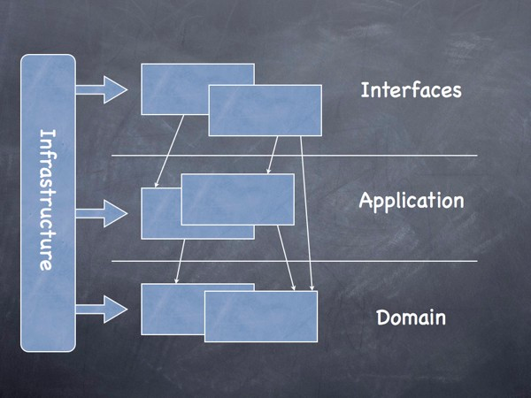

### 领域模型

+ app: 项目入口和构建,配置文件和资源,不侵入业务 
+ test: 单元测试和非正式代码入口,不打包,不上线[新增] 
+ web: 展示层,发布web接口,处理业务无关的请求入参和异常(=controller+VO),不侵入业务  
+ biz: 应用层,for具体应用的业务逻辑,应对业务易变性,避免非核心逻辑污染core层(BO DTO) 
    + 怎么写应用层?有以下几个原则,看下是否符合
        + 业务流程编排和集成
        + 入出参转换,接口适配
        + 安全认证,权限控制
        + 切面功能如日志拦截
        + 应用级异常的处理
        + 调度job入口(不含业务逻辑)
        + 消息订阅入口(不含业务逻辑)
        + 流程引擎功能(不含业务逻辑)
        + 业务报警功能
        + 业务统计分析功能
        + 其他和业务运行无关的模块
+ core: 核心领域层,针对核心业务抽象建模,反映基本业务现实,需保持一定程度的稳定性(BO DTO) 
    + 和biz的区别,只关心核心业务
    + 业务无关的附着功能剥离到应用层实现
+ infras: 基础设施层,封装项目的基础能力,工具性的,业务无关的 
    - infras-dal:数据访问层,封装数据库 redis等数据能力,(=dao层+DO),禁止做任何业务加工 
    - infras-facade:对外接口层,定义对外接口,一般是rpc调用的二方包 
    - infras-integration:对内客户端层,对引用外部服务进行统一封装,做接口防腐和适配 
    - infras-common:
        - util:静态工具类,封装通用工具,如HttpUtils DateUtils. 
        - enum 枚举类 
        - constant 常量类 
        - exception 异常类
        - annotion 注解类
        - model: 公用的bean,各领域对象放到各层里面去实现
        - config: 全局的工具性配置在放在这里

### eg

开发一个查询接口,对地理对象进行检索,基本数据模型为点集 

+ web: 发布接口/query,进行入参校验 错误码处理 封装VO,调用biz层,这是展示层 
+ biz: 点和线是不同类型要素,Point/Line,调用core层查询并分别处理为Point/Line,这是应用层 
+ core: 封装点集查询逻辑,调用dal层,用数据库或缓存,建立查询索引等,这是核心业务层 
+ infras基础设施能力 
    - dal: mybatis支持的数据访问层,仅做工具性查询,关注sql,redis指令等,这是数据访问层 
    - facade: 对外接口模型,有业务依赖Rpc服务,这里写接口,交由biz层实现,发布为二方库 
    - integration: core查询依赖web服务做关联,这里封装客户端服务,以保持对内服务的稳定 
    - common: utils enum constant
+ app:业务逻辑开发完成后,在这里打包,发布 
+ test:写单元测试和非正式代码,后续会要求代码覆盖率 

### 命名规范

+ app: 只有启动类Application
+ test: 除集成类测试,单元测试类命名=原始类+Test后缀
+ web: 后缀controller
+ biz: 后缀Manager
+ core: 后缀service
+ dal: 后缀Mapper,实体类DO和数据库表一一对应
+ facade: 后缀facade
+ integration : 后缀client
+ model: DTO数据传输性质如序列化 BO业务封装对象最常见 VO面向显示层的属性输出
+ util: 后缀utils
+ enum: 后缀enum
+ constant: Property等,不做强制约束,做到见名知意
+ exception: 后缀Exception Error

### 开发规范

+ 业务逻辑只发生在biz层和core层,禁止在其他层里面出现任何业务逻辑
+ 各模块内保持单一职责,按照业务或职责划分package
+ 禁止在业务中直接引用外部服务,必须在integration中处理成client,并处理异常情况
+ 禁止core依赖biz层,web依赖dal层
+ 禁止更改各个model的原始依赖顺序,如发现无法引用,请考虑依赖的合理性
+ 请保持dal层sql或指令的简洁性,不推荐写复杂sql或在sql中实现业务逻辑,要短平快
+ 统一在父pom里面处理依赖
+ 常量类使用接口或者枚举

### 日志规范

+ 日志分级,error/other,分别输出到不同文件
+ 禁止error到处飞,线上新增error日志必须高度敏感,做好监控
+ 系统的入口和出口,以及关键位置必须有日志输出,不要怕日志打的多
+ 线上禁止输出debug
+ 输出日志需带trace信息

### 异常规范

+ 内部异常类统一继承自UnimapException,对可感知业务异常进行封装
+ 异常根据严重程度分级 ERROR WARNING,其中ERROR会拦截输出到error日志中
+ 对外异常进行分类,定义错误码体系
+ 建议将受检异常转为非受检异常

### Git规范

+ 主分支 master 主分支的合并应该在预发通过后,禁止直接提交master
+ 功能分支 feature-*-#version 开发分支，在开发阶段使用,禁止提交不可编译运行的代码
+ 发布版本 release-*-#version 测试和预发分支,提交QA的相对稳定版本
+ 紧急修复分支 bugfix-*-#version 紧急修复线上bug
+ 如无明确的版本计划,version建议为上线的日期
+ 编码为utf8,换行符为\r LF,禁止Tab

### URL规范

+ 全部小写,单词间用-中划线分割
+ 读请求为get,写请求为post
+ 对外进行Response统一封装
+ 建议rest风格,参数小于等于3个

